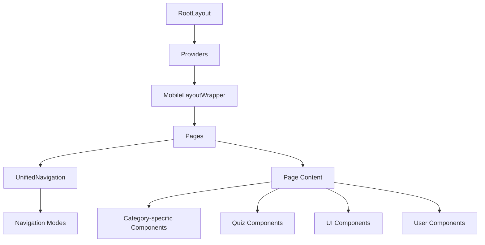

# TechKwiz Complete Reference Guide

**Version 1.0** | **Last Updated:** September 14, 2025 | **Maintained by:** TechKwiz Development Team

## 🎯 Overview

This document serves as the complete reference guide for the TechKwiz Quiz App. It consolidates all documentation, design standards, architecture decisions, and implementation details into a single comprehensive resource that can be used to:
- Recreate the website from scratch
- Understand the complete architecture and design
- Maintain consistency during future development
- Onboard new team members
- Ensure quality during code reviews and testing

## 📁 Complete Project Structure

```
techkwiz-quiz-app/
├── README.md
├── next.config.js
├── package.json
├── tsconfig.json
├── tailwind.config.js
├── postcss.config.js
├── playwright.config.ts
├── sentry.client.config.ts
├── sentry.edge.config.ts
├── sentry.server.config.ts
├── public/
│   ├── favicon.ico
│   ├── robots.txt
│   └── sitemap.xml
├── src/
│   ├── app/
│   │   ├── layout.tsx
│   │   ├── page.tsx (Homepage)
│   │   ├── providers.tsx
│   │   ├── global-error.tsx
│   │   ├── globals.css
│   │   ├── robots.ts
│   │   ├── sitemap.ts
│   │   ├── api/
│   │   ├── about/
│   │   ├── privacy/
│   │   ├── profile/
│   │   ├── leaderboard/
│   │   ├── start/
│   │   └── quiz/[category]/
│   ├── components/
│   │   ├── ads/
│   │   ├── analytics/
│   │   ├── layout/
│   │   ├── modals/
│   │   ├── navigation/
│   │   ├── quiz/
│   │   ├── rewards/
│   │   ├── ui/
│   │   └── user/
│   ├── data/
│   ├── hooks/
│   ├── types/
│   ├── utils/
│   └── config/
└── docs/
    ├── DESIGN_SYSTEM.md
    ├── README.md
    ├── website-standards/
    │   ├── WEBSITE_DESIGN_STANDARDS.md
    │   └── COMPLETE_VISUAL_GUIDELINES.md
    ├── architecture/
    │   └── COMPONENT_ORGANIZATION.md
    ├── user-flows/
    │   └── COMPLETE_USER_JOURNEY.md
    ├── components/
    │   └── UI_COMPONENT_STANDARDS.md
    ├── accessibility/
    │   └── ACCESSIBILITY_STANDARDS.md
    ├── testing/
    │   └── VISUAL_REGRESSION_TESTING.md
    └── ...
```

## 🎨 Design System Overview

### Color Palette
The TechKwiz design system is built around a blue gradient background with a glass effect UI:

```css
/* Primary Background Gradient */
background: linear-gradient(135deg, #1e3c72 0%, #2a5298 100%);

/* Glass Effect Components */
background: rgba(30, 60, 114, 0.8);
backdrop-filter: blur(10px);
border: 1px solid rgba(255, 255, 255, 0.1);
border-radius: 16px;
box-shadow: 0 8px 32px rgba(0, 0, 0, 0.3);
```

### Typography
The Inter font family provides excellent readability:

```css
@import url('https://fonts.googleapis.com/css2?family=Inter:wght@300;400;500;600;700;800&display=swap');

body {
  font-family: 'Inter', system-ui, sans-serif;
}
```

### Spacing System
All spacing follows a 4px grid system:

```css
--space-0: 0;        /* 0px */
--space-1: 0.25rem;  /* 4px */
--space-2: 0.5rem;   /* 8px */
--space-3: 0.75rem;  /* 12px */
--space-4: 1rem;     /* 16px */
--space-6: 1.5rem;   /* 24px */
--space-8: 2rem;     /* 32px */
--space-12: 3rem;    /* 48px */
```

## 🧩 Component Architecture

### Core Components

#### Unified Navigation
Located at `src/components/navigation/UnifiedNavigation.tsx`, this component provides three navigation modes:
1. **Minimal Mode**: Logo only (homepage)
2. **Simple Mode**: Logo + basic links (quiz pages)
3. **Full Mode**: Complete navigation with user info (category/profile pages)

#### Quiz Interface
Located at `src/components/quiz/UnifiedQuizInterface.tsx`, this component handles the core quiz experience with:
- Question display
- Answer options with feedback
- Progress tracking
- Timer integration

#### Category Cards
Located at `src/components/ui/CategoryCard.tsx`, these components display quiz categories with:
- Category information
- Entry fees and prizes
- Affordability status
- Interactive play buttons

### Component Hierarchy


## 🔄 User Journey Mapping

### 1. Homepage Experience
Users start at the homepage (`/`) which provides a quick 5-question quiz to engage new users:

1. User visits homepage
2. Answers 5 quick questions
3. Views immediate results
4. Redirected to profile creation after 90 seconds

### 2. Profile Creation
After completing the quick quiz, users are prompted to create a profile:

1. Authentication modal (if not logged in)
2. Profile creation form
3. Avatar selection
4. Redirect to category selection

### 3. Category Selection
Users browse available quiz categories at `/start`:

1. View category cards
2. Select a category
3. Navigate to quiz (if sufficient coins)
4. Redirect to insufficient coins page (if not enough coins)

### 4. Quiz Experience
Users participate in full quizzes at `/quiz/:category`:

1. Category introduction
2. Question answering with timer
3. Immediate feedback
4. Results display
5. Coin rewards
6. Achievement notifications
7. Redirect to category selection after 90 seconds

### 5. Profile Management
Users manage their profile at `/profile`:

1. View personal information
2. Check coin balance
3. Browse achievements
4. View quiz history

### 6. Leaderboard
Users view rankings at `/leaderboard`:

1. See top performers
2. View own position
3. Browse other users

## 🎮 Core Functionality

### Quiz System
The quiz system is the core of the application:

#### Question Structure
```typescript
interface QuizQuestion {
  id: string;
  question: string;
  options: string[];
  correct_answer: number;
  difficulty: 'beginner' | 'intermediate' | 'advanced';
  fun_fact: string;
  category: string;
  subcategory: string;
}
```

#### Answer Flow
1. User selects an answer
2. Immediate visual feedback (selected state)
3. Brief pause for feedback processing
4. Display correctness (correct/incorrect state)
5. Award coins for correct answers
6. Progress to next question or complete quiz

#### Reward System
- 25 coins per correct answer
- Streak multipliers for daily play
- Achievement bonuses
- Category completion rewards

### User System
The user system manages player profiles and progression:

#### User Structure
```typescript
interface User {
  id: string;
  name: string;
  avatar: string;
  coins: number;
  level: number;
  totalQuizzes: number;
  correctAnswers: number;
  joinDate: string;
  quizHistory: QuizHistory[];
  streak: number;
}
```

#### Authentication Flow
1. Guest play (homepage quiz only)
2. Authentication required for full features
3. Profile creation after first quiz
4. Persistent login state

### Achievement System
Achievements motivate continued engagement:

#### Achievement Types
- Quiz completion milestones
- Streak achievements
- Category mastery
- Coin collection goals

#### Unlock Flow
1. User performs achievement-triggering action
2. System checks achievement conditions
3. New achievements are unlocked
4. Notification is displayed
5. Achievement is added to user profile

## 📱 Responsive Design Implementation

### Mobile-First Approach
All designs start with mobile styling and enhance for larger screens:

#### Breakpoints
```css
/* Mobile First - Base styles */
.container {
  padding: 1rem;
}

/* Small Devices (640px) */
@media (min-width: 640px) {
  .container {
    padding: 1.5rem;
  }
}

/* Medium Devices (768px) */
@media (min-width: 768px) {
  .container {
    padding: 2rem;
    max-width: 768px;
    margin: 0 auto;
  }
}
```

#### Touch Optimization
- Minimum 44px touch targets
- Adequate spacing between interactive elements
- Clear visual feedback on interaction
- Simplified navigation for small screens

## 🎭 Animation System

### Framer Motion Integration
Smooth animations enhance the user experience:

#### Page Transitions
```tsx
<motion.div
  initial={{ opacity: 0, scale: 0.95 }}
  animate={{ opacity: 1, scale: 1 }}
  transition={{ duration: 0.3 }}
>
  Page Content
</motion.div>
```

#### Interactive Feedback
```tsx
<motion.button
  whileHover={{ scale: 1.02 }}
  whileTap={{ scale: 0.98 }}
>
  Interactive Button
</motion.button>
```

### CSS Animations
Custom animations provide specific feedback:

#### Quiz Feedback
```css
@keyframes correctAnswer {
  0% { transform: scale(1); }
  50% { transform: scale(1.1); }
  100% { transform: scale(1.05); }
}

@keyframes shake {
  0%, 100% { transform: translateX(0); }
  25% { transform: translateX(-5px); }
  75% { transform: translateX(5px); }
}
```

## 🔧 Technical Implementation

### Next.js 15 App Router
The application uses the latest Next.js App Router architecture:

#### Route Structure
```
src/app/
├── page.tsx (Homepage)
├── start/page.tsx (Category Selection)
├── quiz/[category]/page.tsx (Quiz Pages)
├── profile/page.tsx (User Profile)
├── leaderboard/page.tsx (Leaderboard)
├── about/page.tsx (About Page)
└── privacy/page.tsx (Privacy Policy)
```

#### Data Fetching
- Static generation for category data
- Client-side state management for user data
- Dynamic imports for heavy components
- Error boundaries for graceful degradation

### State Management
The application uses React Context for global state:

#### Provider Structure
```tsx
// src/app/providers.tsx
export function Providers({ children }: { children: React.ReactNode }) {
  const [state, dispatch] = useReducer(appReducer, initialState);
  
  return (
    <AppContext.Provider value={{ state, dispatch }}>
      {children}
    </AppContext.Provider>
  );
}
```

#### State Structure
```typescript
interface AppState {
  user: User | null;
  isAuthenticated: boolean;
  loading: boolean;
  coins: number;
  streak: number;
  achievements: Achievement[];
}
```

### Performance Optimization
Several techniques ensure optimal performance:

#### Code Splitting
```tsx
const UnifiedQuizInterface = dynamic(
  () => import('../components/quiz/UnifiedQuizInterface').then(mod => mod.UnifiedQuizInterface),
  {
    ssr: false,
    loading: () => <div className="h-64 bg-gray-800/50 rounded-xl animate-pulse" />
  }
);
```

#### Lazy Loading
- Dynamic imports for non-critical components
- Suspense boundaries for loading states
- Prefetching for anticipated navigation

#### Caching
- localStorage for user data persistence
- Session storage for temporary data
- Browser caching for static assets

## 🧪 Testing Strategy

### Visual Regression Testing
Playwright is used for comprehensive visual testing:

#### Test Structure
```typescript
// tests/e2e/homepage-quiz-detailed.spec.ts
test.describe('Homepage Quiz - Detailed Flow', () => {
  test('Mobile - Default State', async ({ page }) => {
    await page.goto('/');
    await expect(page).toHaveScreenshot('homepage-default-mobile.png', {
      threshold: 0.01,
      animations: 'disabled'
    });
  });
});
```

#### Coverage
- All core pages across viewports
- Component states (default, hover, focus, active)
- User flows from start to finish
- Responsive behavior at all breakpoints

### Unit Testing
Jest and React Testing Library for component testing:

#### Component Testing
```tsx
// components/quiz/UnifiedQuizInterface.test.tsx
test('renders question and options correctly', () => {
  render(
    <UnifiedQuizInterface
      question={mockQuestion}
      selectedAnswer={null}
      onAnswerSelect={mockOnAnswerSelect}
      // ... other props
    />
  );
  
  expect(screen.getByText(mockQuestion.question)).toBeInTheDocument();
  mockQuestion.options.forEach(option => {
    expect(screen.getByText(option)).toBeInTheDocument();
  });
});
```

### Accessibility Testing
Comprehensive accessibility compliance:

#### Automated Testing
- axe-core integration
- Lighthouse accessibility audits
- WAVE evaluation tool

#### Manual Testing
- Screen reader compatibility
- Keyboard navigation
- Focus management
- Color contrast verification

## 🛡️ Security Implementation

### Authentication Security
- Secure token storage
- Session management
- Logout functionality
- Guest play limitations

### Data Protection
- User data encryption
- Secure localStorage usage
- Input validation
- Error handling without exposing sensitive information

### Third-Party Integration Security
- Content Security Policy
- Secure API endpoints
- Analytics data anonymization
- Ad network compliance

## 🚀 Deployment and Monitoring

### CI/CD Pipeline
GitHub Actions for automated deployment:

#### Workflow
1. Code push to repository
2. Automated testing
3. Build and deployment
4. Monitoring activation

### Error Monitoring
Sentry integration for error tracking:

#### Error Handling
```typescript
try {
  // Critical operation
} catch (error) {
  Sentry.captureException(error, {
    tags: { component: 'HomePage', action: 'navigateToStart' }
  });
}
```

### Performance Monitoring
- Page load metrics
- User interaction tracking
- Error rate monitoring
- Performance optimization alerts

## 📚 Documentation References

All documentation is organized in the [docs/](./) directory:

### Design Documentation
- [Design System](./DESIGN_SYSTEM.md) - Complete visual design system
- [Website Design Standards](./website-standards/WEBSITE_DESIGN_STANDARDS.md) - UI/UX standards and compliance
- [Complete Visual Guidelines](./website-standards/COMPLETE_VISUAL_GUIDELINES.md) - Detailed visual implementation

### Architecture Documentation
- [Component Organization](./architecture/COMPONENT_ORGANIZATION.md) - Component structure and relationships
- [User Journey](./user-flows/COMPLETE_USER_JOURNEY.md) - Complete user flow mapping
- [UI Component Standards](./components/UI_COMPONENT_STANDARDS.md) - Detailed component specifications

### Quality Assurance Documentation
- [Accessibility Standards](./accessibility/ACCESSIBILITY_STANDARDS.md) - WCAG 2.1 AA compliance
- [Visual Regression Testing](./testing/VISUAL_REGRESSION_TESTING.md) - Testing standards and procedures

## 🆘 Support and Maintenance

### Team Resources
- Code review guidelines
- Pull request templates
- Issue tracking
- Documentation updates

### Update Process
1. Review documentation before making changes
2. Update relevant documentation files
3. Run visual regression tests
4. Verify accessibility compliance
5. Update baselines if changes are intentional

### Troubleshooting
- Common issues and solutions
- Debugging procedures
- Performance optimization guides
- Security best practices

## 📈 Future Development Guidelines

### Feature Addition Process
1. Create feature specification
2. Design component architecture
3. Implement with design system compliance
4. Add comprehensive testing
5. Update documentation
6. Conduct code review

### Design System Evolution
- Regular design system audits
- Component library expansion
- Performance optimization
- Accessibility improvements

### Technical Debt Management
- Code quality metrics
- Refactoring priorities
- Performance benchmarks
- Security updates

---

This document represents the complete reference for the TechKwiz Quiz App as of September 14, 2025. It should be updated whenever significant changes are made to the application to ensure it remains an accurate representation of the system.