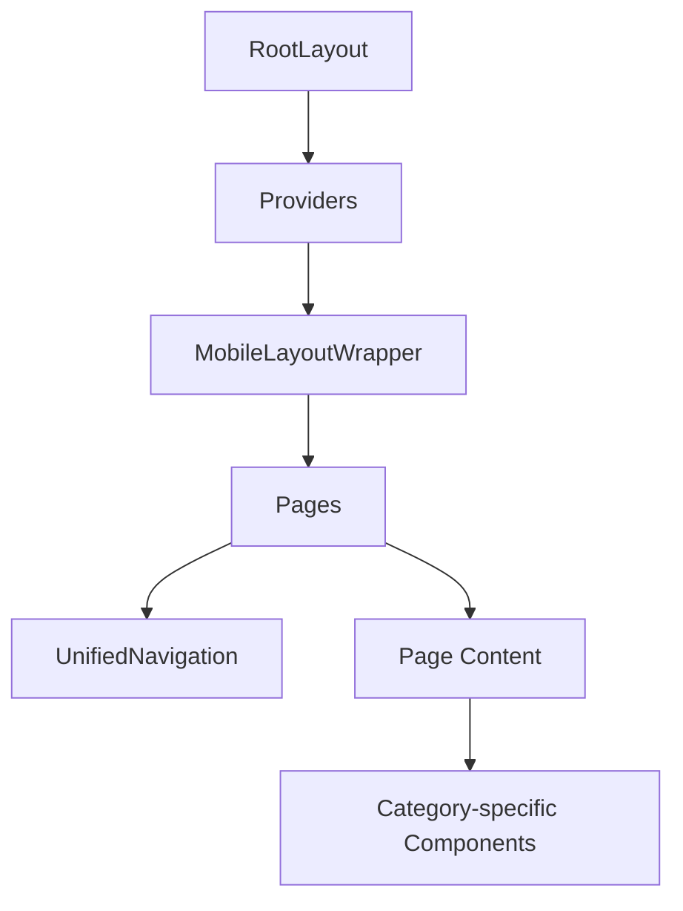
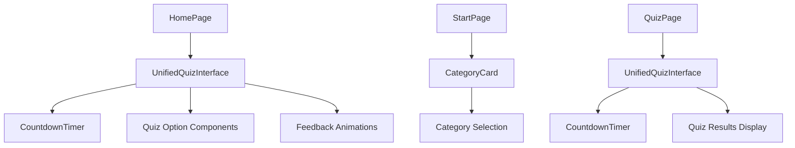

# TechKwiz Component Organization

**Version 1.0** | **Last Updated:** September 14, 2025 | **Maintained by:** TechKwiz Development Team

## 🎯 Overview

This document describes the component organization and architecture of the TechKwiz Quiz App. It provides guidelines for component structure, relationships, and best practices for maintaining a consistent and scalable codebase.

## 📁 Directory Structure

```
src/
├── app/                    # Next.js App Router directory
│   ├── layout.tsx         # Root layout component
│   ├── page.tsx           # Homepage
│   ├── providers.tsx      # Application providers
│   ├── global-error.tsx   # Global error boundary
│   ├── globals.css        # Global styles
│   ├── robots.ts          # Robots.txt configuration
│   ├── sitemap.ts         # Sitemap generation
│   ├── api/               # API routes
│   ├── about/             # About page
│   ├── privacy/           # Privacy page
│   ├── profile/           # User profile page
│   ├── leaderboard/       # Leaderboard page
│   ├── start/             # Category selection page
│   └── quiz/[category]/   # Dynamic quiz pages
├── components/            # Reusable UI components
│   ├── ads/               # Advertisement components
│   ├── analytics/         # Analytics components
│   ├── layout/            # Layout components
│   ├── modals/            # Modal components
│   ├── navigation/        # Navigation components
│   ├── quiz/              # Quiz-related components
│   ├── rewards/           # Reward-related components
│   ├── ui/                # General UI components
│   └── user/              # User-related components
├── data/                  # Static data and database
├── hooks/                 # Custom React hooks
├── types/                 # TypeScript type definitions
├── utils/                 # Utility functions
└── config/                # Configuration files
```

## 🧩 Component Categories

### Layout Components
- **RootLayout** (`src/app/layout.tsx`): Main application layout with providers
- **UnifiedNavigation** (`src/components/navigation/UnifiedNavigation.tsx`): Main navigation bar with multiple modes
- **MobileLayoutWrapper** (`src/components/layout/MobileLayoutWrapper.tsx`): Wrapper for mobile-specific layouts
- **ErrorBoundary** (`src/components/layout/ErrorBoundary.tsx`): Error boundary for catching UI errors

### Navigation Components
- **UnifiedNavigation** (`src/components/navigation/UnifiedNavigation.tsx`): Main navigation with three modes (full, simple, minimal)

### Quiz Components
- **UnifiedQuizInterface** (`src/components/quiz/UnifiedQuizInterface.tsx`): Main quiz interface component
- **CountdownTimer** (`src/components/quiz/CountdownTimer.tsx`): Timer for quiz questions
- **QuizResultsDisplay** (`src/components/quiz/QuizResultsDisplay.tsx`): Results display component

### User Components
- **CreateProfile** (`src/components/user/CreateProfile.tsx`): Profile creation form
- **AvatarSelector** (`src/components/user/AvatarSelector.tsx`): Avatar selection modal
- **ThemeSelector** (`src/components/user/ThemeSelector.tsx`): Theme selection component
- **AchievementNotification** (`src/components/user/AchievementNotification.tsx`): Achievement notification toast
- **AchievementShowcase** (`src/components/user/AchievementShowcase.tsx`): Achievement display grid

### Reward Components
- **RewardCelebrationAnimation** (`src/components/rewards/RewardCelebrationAnimation.tsx`): Reward celebration animation
- **UnifiedRewardPopup** (`src/components/rewards/UnifiedRewardPopup.tsx`): Unified reward popup component

### UI Components
- **CategoryCard** (`src/components/ui/CategoryCard.tsx`): Category display card
- **EnhancedCoinDisplay** (`src/components/ui/EnhancedCoinDisplay.tsx`): Coin balance display
- **StreakMultiplierDisplay** (`src/components/ui/StreakMultiplierDisplay.tsx`): Streak multiplier indicator
- **NewsSection** (`src/components/ui/NewsSection.tsx`): News display section
- **FortuneCookie** (`src/components/ui/FortuneCookie.tsx`): Fortune cookie component

### Modal Components
- **ExitConfirmationModal** (`src/components/modals/ExitConfirmationModal.tsx`): Exit confirmation dialog
- **AuthModal** (`src/components/modals/AuthModal.tsx`): Authentication modal
- **DailyBonusModal** (`src/components/modals/DailyBonusModal.tsx`): Daily bonus reward modal
- **TimeUpModal** (`src/components/modals/TimeUpModal.tsx`): Time up notification modal

### Analytics Components
- **GoogleAnalytics** (`src/components/analytics/GoogleAnalytics.tsx`): Google Analytics integration

### Advertisement Components
- **AdBanner** (`src/components/ads/AdBanner.tsx`): Advertisement banner component

## 🔗 Component Relationships

### Page Component Hierarchy


### UnifiedNavigation Relationships
The UnifiedNavigation component has three modes:
1. **Full Mode** (default): Displays logo, user info, coin balance, and mobile menu
2. **Simple Mode**: Displays logo and basic navigation links
3. **Minimal Mode**: Displays logo only

### Quiz Flow Components


## 🎨 Design Patterns

### Component-Based Architecture
All UI elements are built as reusable React components following these principles:
- **Single Responsibility**: Each component has one clear purpose
- **Reusability**: Components are designed to be used in multiple contexts
- **Composition**: Complex UIs are built by composing simpler components
- **Props Interface**: Clear and typed props interface for each component

### State Management
- **Global State**: Managed through React Context API in `src/app/providers.tsx`
- **Local State**: Managed within components using React useState and useEffect hooks
- **Derived State**: Computed from props or other state values

### Custom Hooks
Custom hooks encapsulate reusable logic:
- **useExitPrevention**: Prevents accidental navigation during quizzes
- **useRevenueOptimization**: Manages revenue optimization features
- **useStreakTracking**: Tracks user streaks and multipliers

## 📐 Component Design Guidelines

### Naming Conventions
- Use PascalCase for component names (e.g., `CategoryCard`)
- Use descriptive names that indicate the component's purpose
- Group related components in appropriately named directories

### File Structure
Each component file should follow this structure:
```typescript
// Component description
'use client' // if client component

import { useState } from 'react'
// Other imports

interface ComponentProps {
  // Props interface
}

export function ComponentName({ prop1, prop2 }: ComponentProps) {
  // Component logic
  
  return (
    // JSX
  )
}
```

### Styling
- Use Tailwind CSS classes for styling
- Follow the design system color palette and typography
- Implement responsive design with mobile-first approach
- Use the glass effect for card components

### Accessibility
- Use semantic HTML elements
- Implement proper ARIA attributes
- Ensure keyboard navigation support
- Maintain sufficient color contrast

## 🧪 Testing Strategy

### Component Testing
- Visual regression tests for all key components
- Unit tests for utility functions within components
- Integration tests for component interactions

### Visual Testing
- Test all component states (default, hover, active, disabled)
- Test responsive behavior across all breakpoints
- Test animations and transitions

## 🔄 Update Process

### Adding New Components
1. Create component in appropriate directory
2. Follow naming and structure conventions
3. Implement design system compliance
4. Add to component documentation
5. Create visual regression tests

### Modifying Existing Components
1. Update component implementation
2. Update documentation
3. Update visual regression tests
4. Verify cross-component compatibility

## 📚 References

- **Design System**: [docs/DESIGN_SYSTEM.md](../DESIGN_SYSTEM.md)
- **Website Design Standards**: [docs/website-standards/WEBSITE_DESIGN_STANDARDS.md](../website-standards/WEBSITE_DESIGN_STANDARDS.md)
- **Project README**: [README.md](../../README.md)