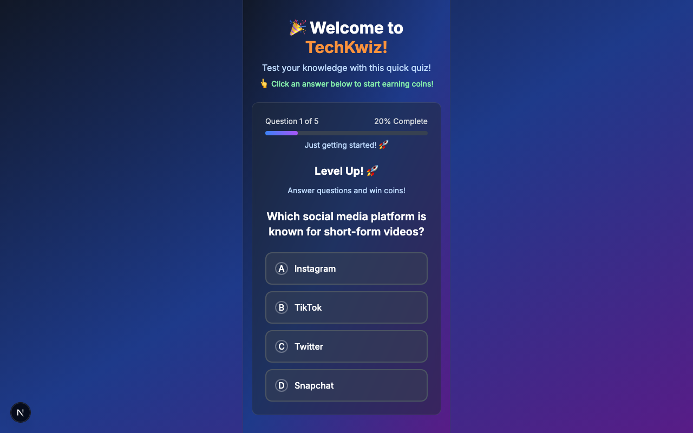
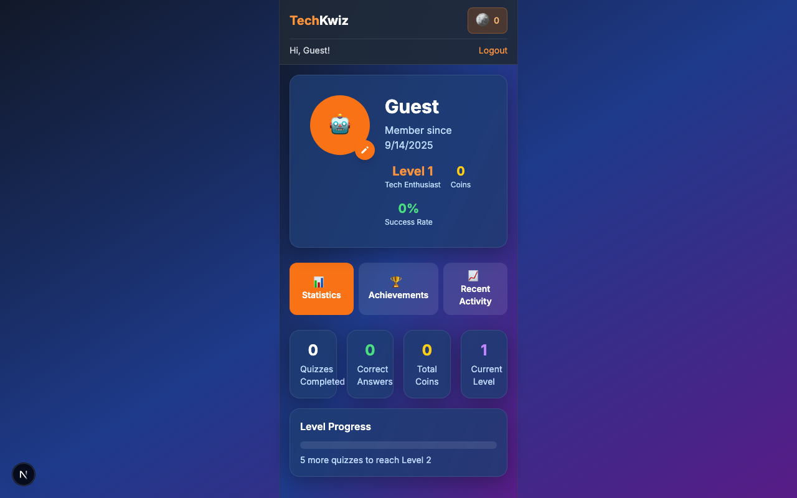
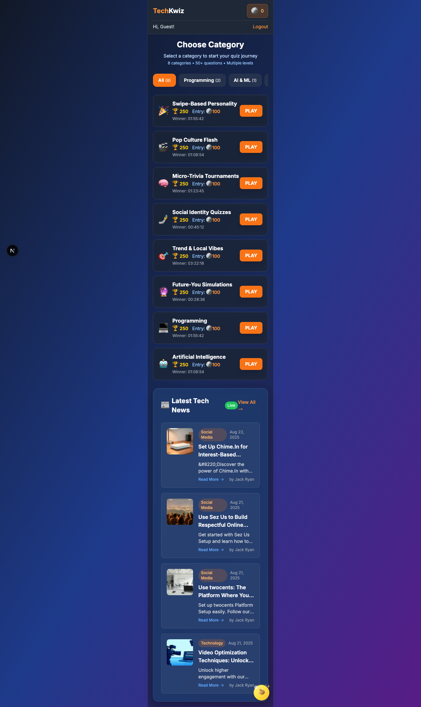
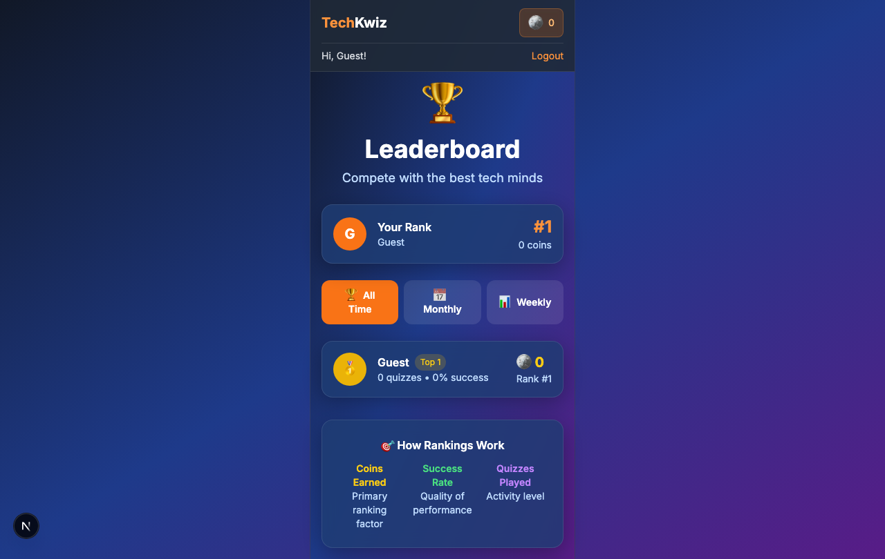
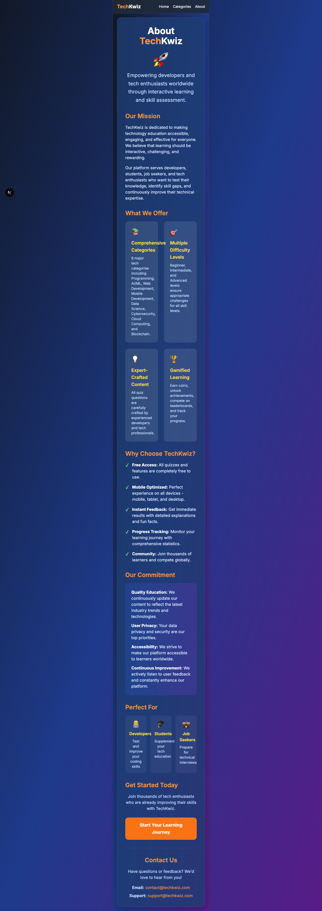
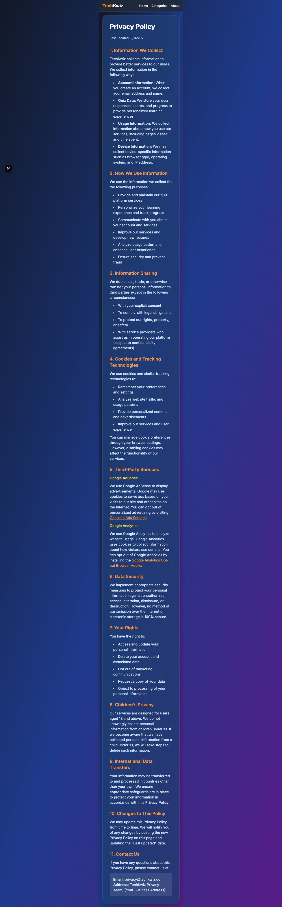

# TechKwiz Design Overview

This document provides a comprehensive overview of the current design of the TechKwiz quiz application, including visual references and design principles.

## Homepage

The homepage serves as the main entry point to the application.

Key elements:
- Welcome message and app introduction
- Quick start options
- Navigation to other sections
- Responsive layout that adapts to different screen sizes

## Start Page

The start page allows users to select quiz categories.

Key elements:
- Category cards with descriptions
- Visual icons for each category
- Responsive grid layout
- Clear call-to-action buttons

## Profile Page

The profile page displays user information and settings.

Key elements:
- User avatar and information
- Achievement showcase
- Settings options
- Clean, organized layout

## Quiz Category Selection

The quiz category selection page shows available quiz topics.

Key elements:
- Grid of category cards
- Descriptive text for each category
- Visual consistency across all categories
- Responsive design for all device sizes

## Leaderboard Page

The leaderboard displays user rankings.

Key elements:
- Ranked list of top performers
- User scores and positions
- Clean data presentation
- Responsive table layout

## About Page

The about page provides information about the application.

Key elements:
- Application description
- Team information
- Contact details
- Clean typography and layout

## Privacy Page

The privacy page contains legal information.

Key elements:
- Privacy policy text
- Terms of service
- Data usage information
- Readable typography for legal content

## Design Principles

1. **Consistency**: All pages follow a consistent design language with unified color schemes, typography, and spacing.

2. **Responsiveness**: The application is designed to work seamlessly across desktop, tablet, and mobile devices.

3. **Accessibility**: Proper contrast ratios, readable typography, and keyboard navigation support.

4. **Performance**: Optimized assets and efficient rendering for fast loading times.

5. **User Experience**: Intuitive navigation, clear feedback, and engaging interactions.

## Color Scheme

The application uses a vibrant yet professional color scheme that:
- Maintains good contrast for readability
- Creates visual hierarchy
- Provides feedback on interactive elements
- Remains consistent across all pages

## Typography

Typography choices focus on:
- Readability across all device sizes
- Hierarchy through font weights and sizes
- Consistency with the overall design language
- Accessibility standards compliance

## Visual Elements

All visual elements including:
- Icons and illustrations
- Buttons and form elements
- Cards and containers
- Animations and transitions

Are designed to be:
- Consistent with the brand identity
- Functional and purposeful
- Accessible to all users
- Optimized for performance

## Screenshots Directory Structure

Screenshots are organized by device type:
- `/desktop/` - Desktop views (1280px width)
- `/mobile/` - Mobile views (375px width)
- `/tablet/` - Tablet views (768px width)

These screenshots serve as:
1. Visual regression testing baselines
2. Design documentation references
3. Issue identification and resolution aids
4. Future development guidance

## Version Information

This documentation represents the current state of the application as of September 14, 2025. Any future changes should be documented and corresponding screenshots updated to maintain accurate design documentation.