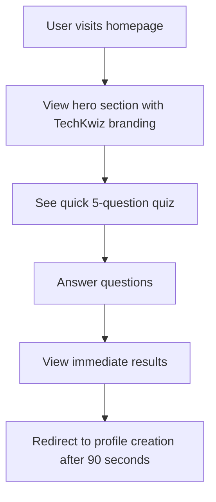
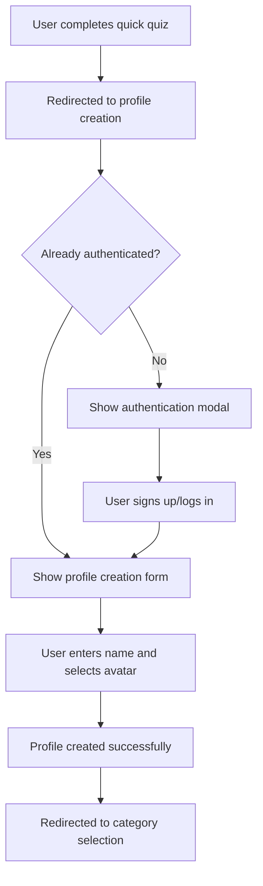
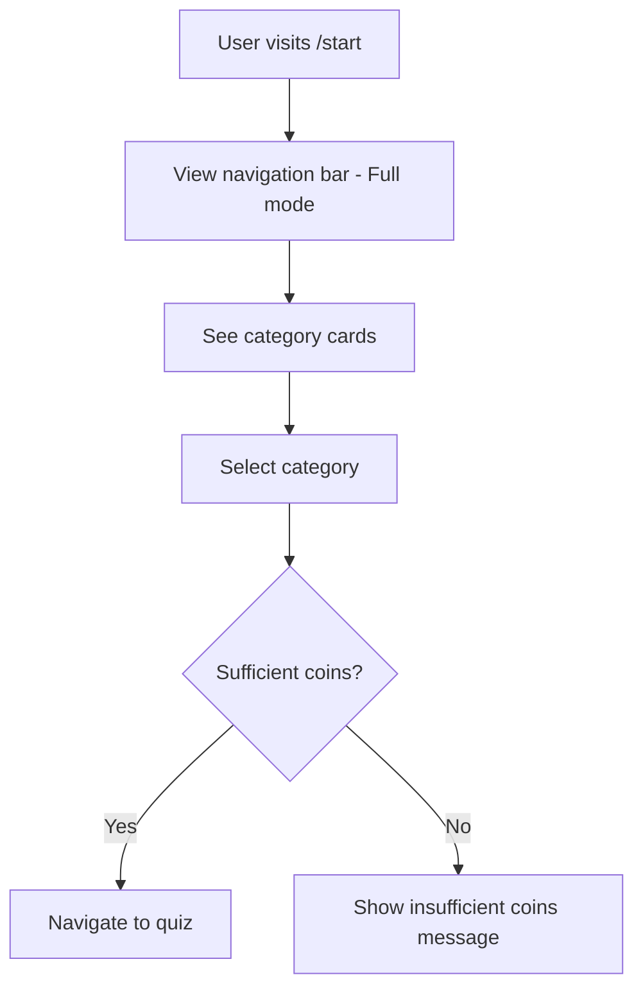
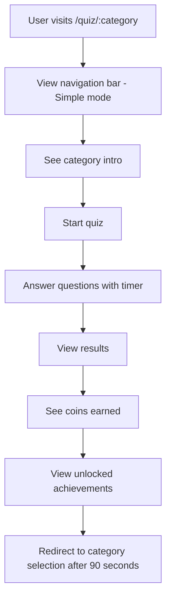
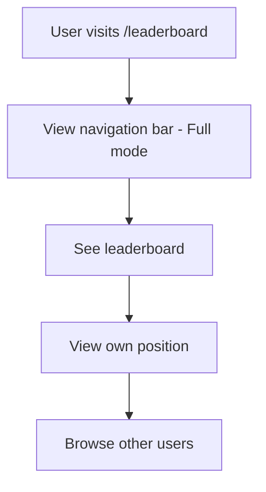
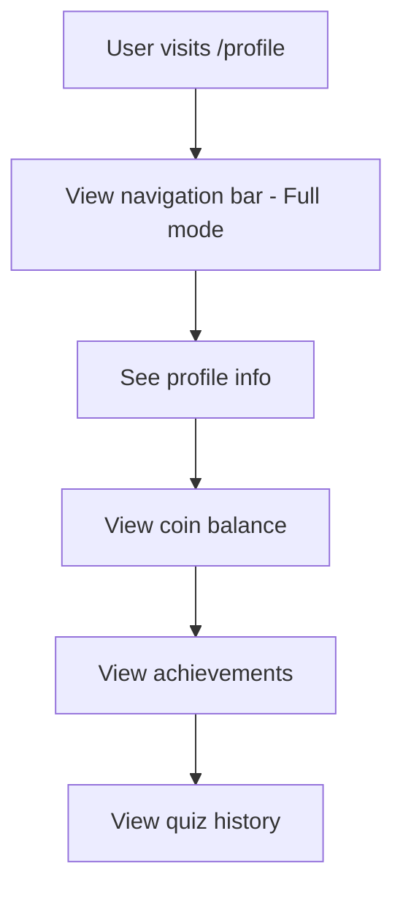
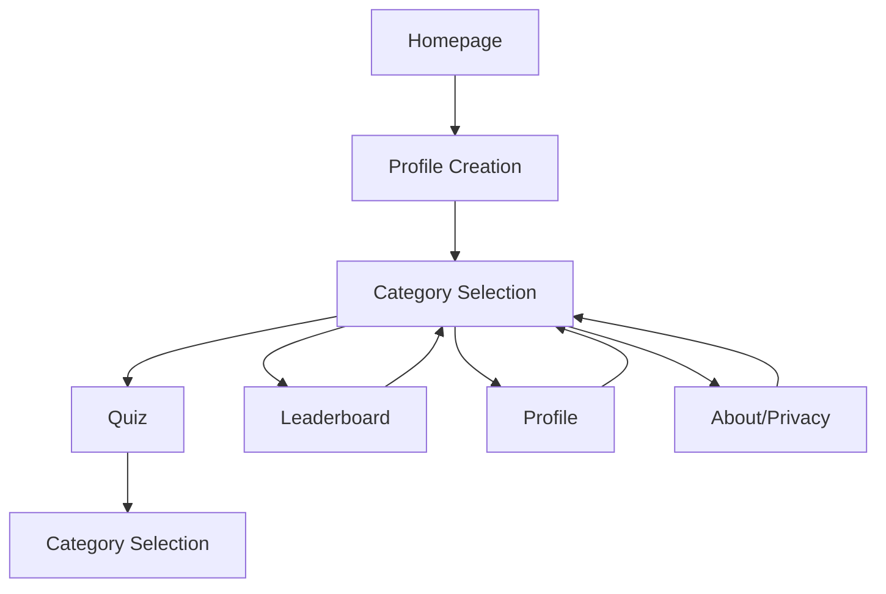
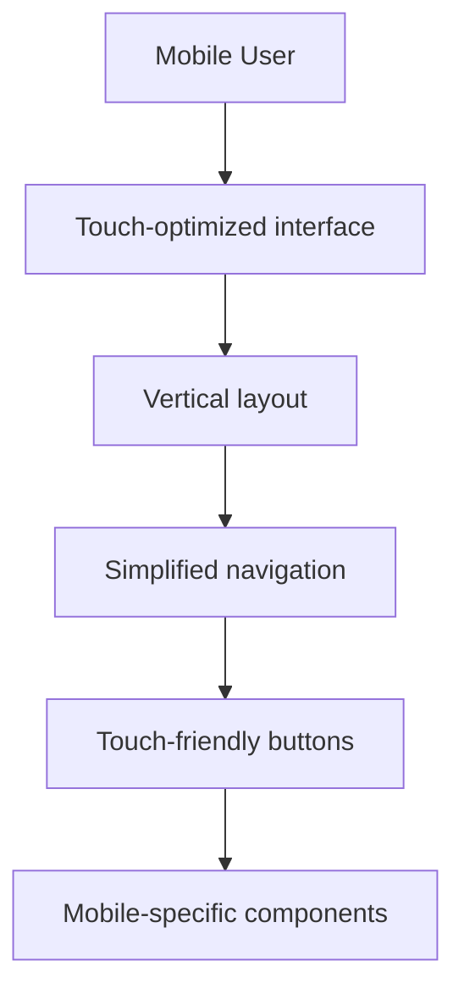
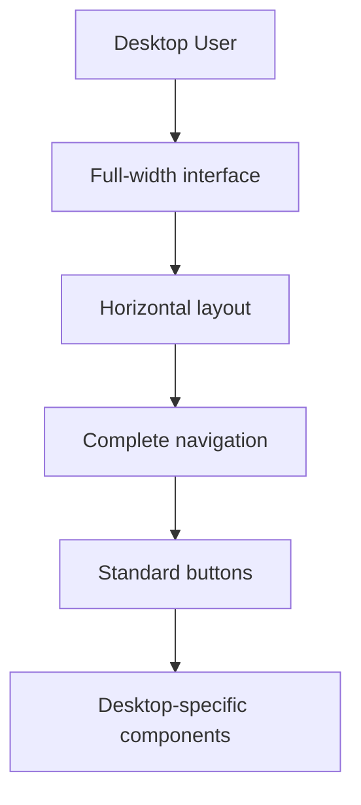
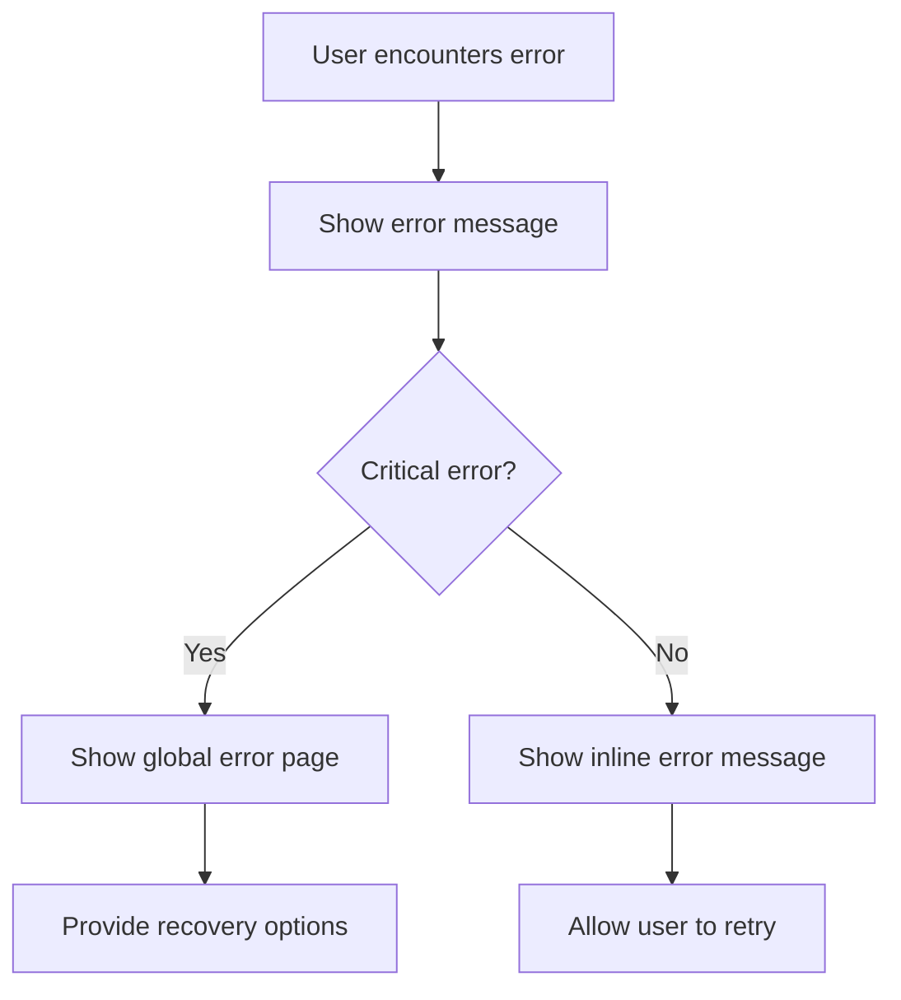

# TechKwiz Complete User Journey

**Version 1.0** | **Last Updated:** September 14, 2025 | **Maintained by:** TechKwiz Development Team

## 🎯 Overview

This document describes the complete user journey through the TechKwiz Quiz App, from initial visit to ongoing engagement. It provides detailed flow diagrams and interaction patterns to ensure consistent user experience across all touchpoints.

## 🚪 Entry Points

### 1. Direct URL Access
Users can access the app through:
- Main domain (`https://techkwiz.com`)
- Specific pages (`https://techkwiz.com/start`, `https://techkwiz.com/profile`, etc.)

### 2. Search Engine Results
Users may arrive via search engines, following SEO-optimized pages.

### 3. Social Media/Referral Links
Users may be referred through social sharing or marketing campaigns.

## 🏠 Homepage Experience

### Initial Visit Flow

### Homepage Components
1. **Navigation Bar** (Minimal mode - logo only)
2. **Quick Quiz Interface** (5 questions)
3. **Results Display**
4. **Profile Creation Redirect**

### Interaction Details
- Users can answer 5 quick questions without authentication
- Each answer provides immediate feedback (correct/incorrect)
- After completing questions, users see their score
- After 90 seconds on results page, users are redirected to profile creation

## 👤 Profile Creation Flow

### Authentication Requirement

### Profile Creation Components
1. **Auth Modal** (if not authenticated)
2. **CreateProfile Form**
3. **Avatar Selector**

### Interaction Details
- Users must authenticate before creating a profile
- Users enter their name and select an avatar
- Profile is saved to localStorage
- User is redirected to category selection page

## 📚 Category Selection Flow

### Category Page Experience

### Category Page Components
1. **Navigation Bar** (Full mode)
2. **Category Cards** (one for each quiz category)
3. **News Section**
4. **Fortune Cookie**

### Interaction Details
- Users see all available quiz categories
- Each category card shows:
  - Icon and name
  - Description
  - Subcategories
  - Entry fee (in coins)
  - Prize pool
  - Play button (disabled if insufficient coins)
- Users can select any category they can afford

## 🎮 Quiz Experience

### Category Quiz Flow

### Quiz Components
1. **Navigation Bar** (Simple mode)
2. **Quiz Interface**
3. **Countdown Timer**
4. **Question Display**
5. **Answer Options**
6. **Results Display**
7. **Reward Popup**

### Interaction Details
- Users answer questions with a 30-second timer per question
- Answer options provide immediate feedback
- Users earn coins for correct answers
- Users may unlock achievements
- After completing quiz, users see results and rewards
- After 90 seconds on results page, users are redirected to category selection

## 🏆 Leaderboard Flow

### Leaderboard Experience

### Leaderboard Components
1. **Navigation Bar** (Full mode)
2. **Leaderboard Display**
3. **User Ranking**

### Interaction Details
- Users can see their ranking among other players
- Leaderboard shows top performers
- Users can see their own position highlighted

## 👤 Profile Management Flow

### Profile Page Experience

### Profile Components
1. **Navigation Bar** (Full mode)
2. **User Info Display**
3. **Coin Balance**
4. **Achievement Showcase**
5. **Quiz History**

### Interaction Details
- Users can view their profile information
- Users can see their coin balance
- Users can view unlocked achievements
- Users can see their quiz history

## 🔄 Navigation Between Sections

### Main Navigation Flow

### Navigation Components
1. **Unified Navigation** (three modes)
2. **Mobile Menu** (hamburger menu on mobile)
3. **Coin Display**
4. **User Info**

### Interaction Details
- Users can navigate between main sections using the navigation bar
- Mobile users have access to a hamburger menu
- Users can see their coin balance in the navigation bar
- Authenticated users see their name and logout option

## 📱 Responsive Experience

### Mobile User Flow

### Desktop User Flow

## 🎯 Engagement Features

### Coin System
- Users earn 25 coins per correct answer
- Users spend coins to enter quizzes
- Users can view their coin balance in the navigation bar

### Achievement System
- Users unlock achievements by completing specific actions
- Achievements are displayed in the profile
- New achievements are notified via toast messages

### Streak Multiplier
- Users build daily streaks by playing quizzes
- Streaks provide coin multipliers
- Multiplier is displayed in the navigation bar

## 🚨 Error Handling

### Common Error Flows

### Error Components
1. **Global Error Boundary**
2. **Inline Error Messages**
3. **Error Pages**

### Interaction Details
- Critical errors show global error page
- Non-critical errors show inline messages
- Users are given options to recover from errors

## 📊 Analytics and Tracking

### User Behavior Tracking
- Page views and navigation paths
- Quiz completion rates
- Coin earning/spending patterns
- Achievement unlock rates
- User retention metrics

### Event Tracking
- Quiz start/completion
- Answer selection
- Coin transactions
- Achievement unlocks
- Navigation events

## ✅ Quality Assurance

### User Flow Testing
- End-to-end testing of all user journeys
- Cross-browser compatibility testing
- Mobile responsiveness testing
- Accessibility compliance testing
- Performance optimization testing

### Visual Regression Testing
- Baseline images for all key pages
- Component state testing
- Responsive breakpoint testing
- Cross-device consistency testing

## 📚 References

- **Website Design Standards**: [docs/website-standards/WEBSITE_DESIGN_STANDARDS.md](../website-standards/WEBSITE_DESIGN_STANDARDS.md)
- **Component Organization**: [docs/architecture/COMPONENT_ORGANIZATION.md](../architecture/COMPONENT_ORGANIZATION.md)
- **Design System**: [docs/DESIGN_SYSTEM.md](../DESIGN_SYSTEM.md)
- **Project README**: [README.md](../../README.md)