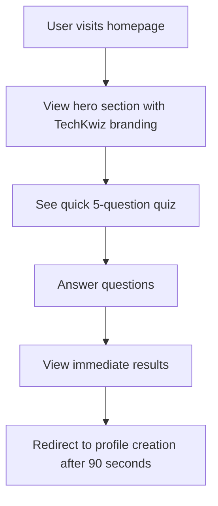
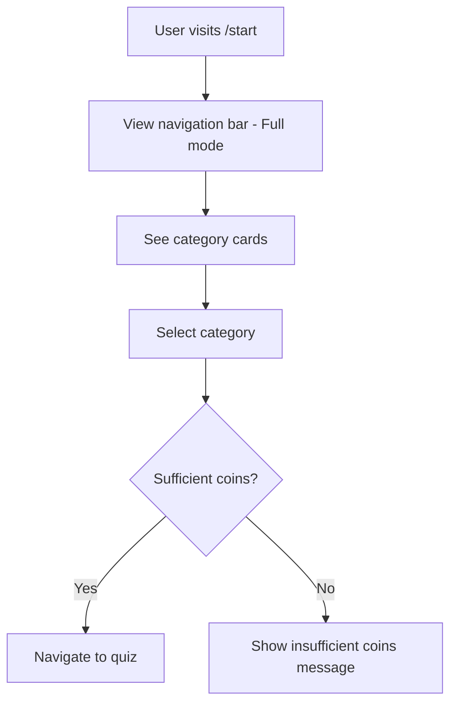
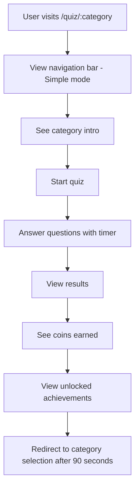

# TechKwiz Complete Visual Guidelines

**Version 1.0** | **Last Updated:** September 14, 2025 | **Maintained by:** TechKwiz Development Team

## 🎯 Overview

This document provides a complete visual reference for the TechKwiz Quiz App. It combines all design system elements, component specifications, and visual standards into a single comprehensive guide that can be used to recreate the website from scratch or verify visual consistency during development.

## 🎨 Complete Color System

### Primary Blue Palette
The primary blue palette forms the foundation of the TechKwiz brand identity:

```css
/* Primary Blue Gradient */
background: linear-gradient(135deg, #1e3c72 0%, #2a5298 100%);

/* Primary Blue Variants */
--primary-blue-500: #3B82F6;  /* Main brand color */
--primary-blue-600: #2563EB;  /* Primary buttons */
--primary-blue-700: #1D4ED8;  /* Pressed states */
--primary-blue-800: #1E40AF;  /* High contrast */
--primary-blue-900: #1E3A8A;  /* Maximum contrast */
```

### Secondary Orange Palette
The secondary orange palette provides energy and highlights:

```css
/* Secondary Orange Variants */
--secondary-orange-500: #F59E0B;  /* Highlights */
--secondary-orange-600: #D97706;  /* Hover states */
```

### Quiz Feedback Colors
These colors provide clear visual feedback during quiz interactions:

```css
/* Quiz Option States */
--quiz-default: rgba(42, 82, 152, 0.8);     /* Default state */
--quiz-selected: rgba(255, 193, 7, 0.8);    /* User selection */
--quiz-correct: rgba(40, 167, 69, 0.8);     /* Correct answer */
--quiz-incorrect: rgba(220, 53, 69, 0.8);   /* Incorrect answer */

/* Semantic Colors */
--success-green: #28A745;  /* Success states */
--warning-yellow: #FFC107; /* Warning states */
--error-red: #DC3545;      /* Error states */
--info-blue: #3B82F6;      /* Informational */
```

### Glass Effect Background
The signature glass effect creates depth while maintaining readability:

```css
.glass-effect {
  background: rgba(30, 60, 114, 0.8);
  backdrop-filter: blur(10px);
  border: 1px solid rgba(255, 255, 255, 0.1);
  border-radius: 16px;
  box-shadow: 0 8px 32px rgba(0, 0, 0, 0.3);
}
```

## 📝 Typography System

### Font Implementation
The Inter font family provides excellent readability across all devices:

```css
@import url('https://fonts.googleapis.com/css2?family=Inter:wght@300;400;500;600;700;800&display=swap');

body {
  font-family: 'Inter', system-ui, sans-serif;
}
```

### Complete Typography Scale
All text elements follow a consistent hierarchy:

| Element | Size (rem) | Weight | Color | Usage |
|---------|------------|--------|-------|-------|
| Page Title (h1) | 2.25 | 800 | White | Main page titles |
| Section Heading (h2) | 1.875 | 700 | White | Section headings |
| Subsection (h3) | 1.5 | 700 | White | Subsection headings |
| Card Title (h4) | 1.25 | 700 | White | Card titles |
| Lead Text | 1.125 | 400 | Blue-200 | Lead paragraphs |
| Body Text | 1 | 400 | White | Standard text |
| Secondary Text | 0.875 | 400 | Blue-200 | Secondary text |
| Caption | 0.75 | 400 | Blue-200 | Metadata |

## 📏 Spacing System (4px Grid)

### Spacing Scale
All spacing follows a consistent 4px grid system:

```css
/* Spacing Variables */
--space-0: 0;        /* 0px */
--space-1: 0.25rem;  /* 4px */
--space-2: 0.5rem;   /* 8px */
--space-3: 0.75rem;  /* 12px */
--space-4: 1rem;     /* 16px */
--space-6: 1.5rem;   /* 24px */
--space-8: 2rem;     /* 32px */
--space-12: 3rem;    /* 48px */
```

### Component Spacing
Consistent padding and margins across components:

| Component | Padding | Notes |
|-----------|---------|-------|
| Quiz Options | 12px 12px | Mobile optimized |
| Cards | 1.5rem | Standard card padding |
| Navigation Bar | 0.75rem 1rem | Nav bar padding |
| Buttons | 0.75rem 1.5rem | Button padding |
| Form Elements | 0.75rem | Input fields |

## 🧩 Component Library

### Buttons

#### Primary Button
Used for primary actions like "Play", "Submit", "Continue":

```tsx
// Component Structure
<button className="button-primary">
  Primary Action
</button>

// CSS Implementation
.button-primary {
  background: linear-gradient(135deg, #3b82f6, #2563eb);
  border: none;
  border-radius: 12px;
  color: white;
  font-weight: 600;
  cursor: pointer;
  transition: all 0.3s ease;
  box-shadow: 0 4px 16px rgba(59, 130, 246, 0.3);
  padding: 0.75rem 1.5rem;
}

.button-primary:hover {
  transform: translateY(-2px);
  box-shadow: 0 6px 20px rgba(59, 130, 246, 0.4);
}

.button-primary:active {
  transform: translateY(0);
}

.button-primary:disabled {
  opacity: 0.6;
  cursor: not-allowed;
  transform: none;
  box-shadow: 0 4px 16px rgba(59, 130, 246, 0.3);
}
```

#### Secondary Button
Used for secondary actions like "Back", "Cancel":

```tsx
// Component Structure
<button className="button-secondary">
  Secondary Action
</button>

// CSS Implementation
.button-secondary {
  background: rgba(42, 82, 152, 0.8);
  border: 2px solid transparent;
  border-radius: 12px;
  color: white;
  font-weight: 600;
  cursor: pointer;
  transition: all 0.3s ease;
  backdrop-filter: blur(10px);
  padding: 0.75rem 1.5rem;
}

.button-secondary:hover {
  background: rgba(42, 82, 152, 1);
  border-color: rgba(255, 255, 255, 0.3);
  transform: translateY(-2px);
  box-shadow: 0 4px 16px rgba(0, 0, 0, 0.2);
}

.button-secondary:active {
  transform: translateY(0);
}

.button-secondary:disabled {
  opacity: 0.6;
  cursor: not-allowed;
  transform: none;
}
```

### Quiz Options
Interactive answer options with clear feedback states:

```tsx
// Component Structure
<div className={`quiz-option ${isSelected ? 'selected' : ''} ${isCorrect ? 'correct' : ''} ${isIncorrect ? 'incorrect' : ''}`}>
  Answer Option Text
</div>

// CSS Implementation
.quiz-option {
  background: rgba(42, 82, 152, 0.8);
  border: 2px solid transparent;
  border-radius: 16px;
  color: white;
  font-weight: 700;
  cursor: pointer;
  transition: all 0.3s ease;
  backdrop-filter: blur(10px);
  padding: 12px 12px;
  text-align: center;
  min-height: 52px;
  display: flex;
  align-items: center;
  justify-content: center;
  font-size: 15px;
  line-height: 1.4;
  width: 100%;
}

/* Mobile-specific improvements */
@media (max-width: 640px) {
  .quiz-option {
    padding: 12px 8px;
    min-height: 48px;
    font-size: 14px;
    border-radius: 20px;
    font-weight: 800;
  }
}

/* For very large mobile screens like OnePlus */
@media (max-width: 640px) and (min-width: 400px) {
  .quiz-option {
    padding: 14px 10px;
    min-height: 52px;
    font-size: 16px;
  }
}

.quiz-option:hover {
  background: rgba(42, 82, 152, 1);
  border-color: rgba(255, 255, 255, 0.3);
  transform: translateY(-2px);
  box-shadow: 0 4px 16px rgba(0, 0, 0, 0.2);
}

.quiz-option.selected {
  background: rgba(255, 193, 7, 0.8);
  border-color: #ffc107;
  transform: scale(1.05);
}

.quiz-option.correct {
  background: rgba(40, 167, 69, 0.8);
  border-color: #28a745;
  animation: correctAnswer 0.6s ease;
}

.quiz-option.incorrect {
  background: rgba(220, 53, 69, 0.8);
  border-color: #dc3545;
  animation: shake 0.5s ease;
}

@keyframes correctAnswer {
  0% { transform: scale(1); }
  50% { transform: scale(1.1); }
  100% { transform: scale(1.05); }
}

@keyframes shake {
  0%, 100% { transform: translateX(0); }
  25% { transform: translateX(-5px); }
  75% { transform: translateX(5px); }
}
```

### Category Cards
Display quiz categories with entry fees and prizes:

```tsx
// Component Structure
<CategoryCard 
  category={category} 
  onSelect={handleCategorySelect} 
  userCoins={userCoins} 
/>

// CSS Implementation
.category-card {
  background: rgba(30, 60, 114, 0.8);
  backdrop-filter: blur(10px);
  border: 1px solid rgba(255, 255, 255, 0.1);
  border-radius: 16px;
  box-shadow: 0 8px 32px rgba(0, 0, 0, 0.3);
  padding: 1.5rem;
  transition: all 0.3s ease;
  cursor: pointer;
}

.category-card:hover {
  transform: translateY(-5px);
  box-shadow: 0 12px 40px rgba(0, 0, 0, 0.4);
}

.category-icon {
  font-size: 3rem;
  margin-bottom: 0.75rem;
  transition: transform 0.3s ease;
}

.category-card:hover .category-icon {
  transform: scale(1.1);
}

.category-name {
  font-size: 1.25rem;
  font-weight: 700;
  color: white;
  margin-bottom: 0.5rem;
}

.category-description {
  font-size: 0.875rem;
  color: #bfdbfe;
  margin-bottom: 1rem;
}

.subcategory-tag {
  background: rgba(255, 255, 255, 0.1);
  color: #bfdbfe;
  padding: 0.25rem 0.75rem;
  border-radius: 9999px;
  font-size: 0.75rem;
  margin-right: 0.5rem;
  margin-bottom: 0.5rem;
  display: inline-block;
}

.fee-prize-row {
  display: flex;
  justify-content: space-between;
  margin-bottom: 1rem;
}

.fee-label, .prize-label {
  color: #bfdbfe;
  font-size: 0.875rem;
}

.fee-value {
  color: #fbbf24;
  font-weight: 600;
  display: flex;
  align-items: center;
}

.prize-value {
  color: #34d399;
  font-weight: 600;
  display: flex;
  align-items: center;
}

.play-button {
  width: 100%;
  padding: 0.75rem;
  border-radius: 0.75rem;
  font-weight: 600;
  transition: all 0.3s ease;
  display: flex;
  align-items: center;
  justify-content: center;
  gap: 0.5rem;
}

.play-button:enabled {
  background: linear-gradient(135deg, #f59e0b, #d97706);
  color: black;
  box-shadow: 0 4px 16px rgba(245, 158, 11, 0.3);
}

.play-button:enabled:hover {
  background: linear-gradient(135deg, #fbbf24, #f59e0b);
  transform: translateY(-2px);
  box-shadow: 0 6px 20px rgba(245, 158, 11, 0.4);
}

.play-button:disabled {
  background: #4b5563;
  color: #9ca3af;
  cursor: not-allowed;
}
```

## 📱 Responsive Design System

### Breakpoint Definitions
Mobile-first responsive design with clear breakpoints:

```css
/* Mobile First - Base styles for mobile */
.container {
  padding: 1rem;
}

/* Small Devices (640px) */
@media (min-width: 640px) {
  .container {
    padding: 1.5rem;
  }
}

/* Medium Devices (768px) */
@media (min-width: 768px) {
  .container {
    padding: 2rem;
    max-width: 768px;
    margin: 0 auto;
  }
}

/* Large Devices (1024px) */
@media (min-width: 1024px) {
  .container {
    max-width: 1024px;
  }
}

/* Extra Large Devices (1280px) */
@media (min-width: 1280px) {
  .container {
    max-width: 1280px;
  }
}
```

### Grid System
Flexible grid layouts for different screen sizes:

```css
/* Mobile Grid */
.grid {
  display: grid;
  gap: 1rem;
}

.grid-cols-1 {
  grid-template-columns: 1fr;
}

/* Small Devices */
@media (min-width: 640px) {
  .grid-cols-2 {
    grid-template-columns: 1fr 1fr;
  }
}

/* Medium Devices */
@media (min-width: 768px) {
  .grid-cols-3 {
    grid-template-columns: 1fr 1fr 1fr;
  }
}

/* Large Devices */
@media (min-width: 1024px) {
  .grid-cols-4 {
    grid-template-columns: 1fr 1fr 1fr 1fr;
  }
}
```

## 🎭 Animation System

### Framer Motion Patterns
Consistent motion design with Framer Motion:

```tsx
// Page Transitions
<motion.div
  initial={{ opacity: 0, scale: 0.95 }}
  animate={{ opacity: 1, scale: 1 }}
  transition={{ duration: 0.3 }}
>
  Page Content
</motion.div>

// Button Interactions
<motion.button
  whileHover={{ scale: 1.02 }}
  whileTap={{ scale: 0.98 }}
>
  Interactive Button
</motion.button>

// Card Hover Effects
<motion.div
  whileHover={{ scale: 1.02, y: -5 }}
  transition={{ type: "spring", stiffness: 300 }}
>
  Card Content
</motion.div>
```

### CSS Animations
Custom animations for feedback and transitions:

```css
/* Fade In Animation */
@keyframes fadeIn {
  from {
    opacity: 0;
    transform: translateY(20px);
  }
  to {
    opacity: 1;
    transform: translateY(0);
  }
}

.fade-in {
  animation: fadeIn 0.5s ease-out;
}

/* Slide Up Animation */
@keyframes slideUp {
  from {
    opacity: 0;
    transform: translateY(30px);
  }
  to {
    opacity: 1;
    transform: translateY(0);
  }
}

.slide-up {
  animation: slideUp 0.6s ease-out;
}

/* Bounce In Animation */
@keyframes bounceIn {
  0%, 20%, 40%, 60%, 80%, 100% {
    transition-timing-function: cubic-bezier(0.215, 0.610, 0.355, 1.000);
  }
  
  0% {
    opacity: 0;
    transform: scale3d(.3, .3, .3);
  }
  
  20% {
    transform: scale3d(1.1, 1.1, 1.1);
  }
  
  40% {
    transform: scale3d(.9, .9, .9);
  }
  
  60% {
    opacity: 1;
    transform: scale3d(1.03, 1.03, 1.03);
  }
  
  80% {
    transform: scale3d(.97, .97, .97);
  }
  
  100% {
    opacity: 1;
    transform: scale3d(1, 1, 1);
  }
}

.bounce-in {
  animation: bounceIn 0.75s ease-out;
}

/* Coin Animation */
@keyframes coinBounce {
  0%, 20%, 50%, 80%, 100% {
    transform: translateY(0);
  }
  40% {
    transform: translateY(-10px);
  }
  60% {
    transform: translateY(-5px);
  }
}

.coin-animation {
  animation: coinBounce 0.6s ease-out;
}
```

## 🧭 Navigation System

### Unified Navigation Component
Three distinct navigation modes:

```tsx
// Minimal Mode (Homepage)
<UnifiedNavigation mode="minimal" />

// Simple Mode (Quiz Pages)
<UnifiedNavigation mode="simple" />

// Full Mode (Category/Profile Pages)
<UnifiedNavigation mode="full" />
```

### Navigation Structure
Consistent navigation across all pages:

```tsx
const navigationItems = [
  { name: 'Home', href: '/', icon: '🏠' },
  { name: 'Categories', href: '/start', icon: '📚' },
  { name: 'Leaderboard', href: '/leaderboard', icon: '🏆' },
  { name: 'Profile', href: '/profile', icon: '👤' },
];
```

## 🔄 Complete User Flow Visualization

### Homepage Experience


### Category Selection


### Quiz Experience


## ✅ Visual Consistency Checklist

### Design System Compliance
- [ ] All colors match the defined palette
- [ ] Typography follows the established hierarchy
- [ ] Spacing uses the 4px grid system
- [ ] Components use the glass effect consistently
- [ ] Buttons follow the defined styles
- [ ] Quiz options have proper feedback states
- [ ] Animations are smooth and purposeful

### Responsive Design
- [ ] Mobile layout is optimized for touch
- [ ] Tablet layout uses appropriate spacing
- [ ] Desktop layout maximizes screen real estate
- [ ] Text remains readable at all sizes
- [ ] Interactive elements are appropriately sized

### Accessibility
- [ ] Color contrast meets WCAG 2.1 AA standards
- [ ] All interactive elements are keyboard accessible
- [ ] Focus indicators are visible
- [ ] Text can be resized up to 200%
- [ ] Animations respect reduced motion preferences

## 📚 References

- **Design System**: [docs/DESIGN_SYSTEM.md](../DESIGN_SYSTEM.md)
- **Website Design Standards**: [docs/website-standards/WEBSITE_DESIGN_STANDARDS.md](./WEBSITE_DESIGN_STANDARDS.md)
- **Component Organization**: [docs/architecture/COMPONENT_ORGANIZATION.md](../architecture/COMPONENT_ORGANIZATION.md)
- **UI Component Standards**: [docs/components/UI_COMPONENT_STANDARDS.md](../components/UI_COMPONENT_STANDARDS.md)
- **Accessibility Standards**: [docs/accessibility/ACCESSIBILITY_STANDARDS.md](../accessibility/ACCESSIBILITY_STANDARDS.md)
- **Visual Regression Testing**: [docs/testing/VISUAL_REGRESSION_TESTING.md](../testing/VISUAL_REGRESSION_TESTING.md)
- **Global Styles**: [src/app/globals.css](../../src/app/globals.css)