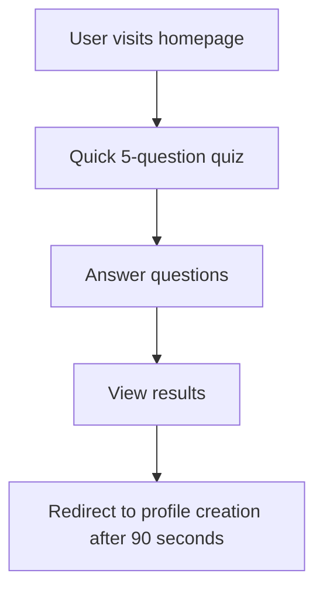
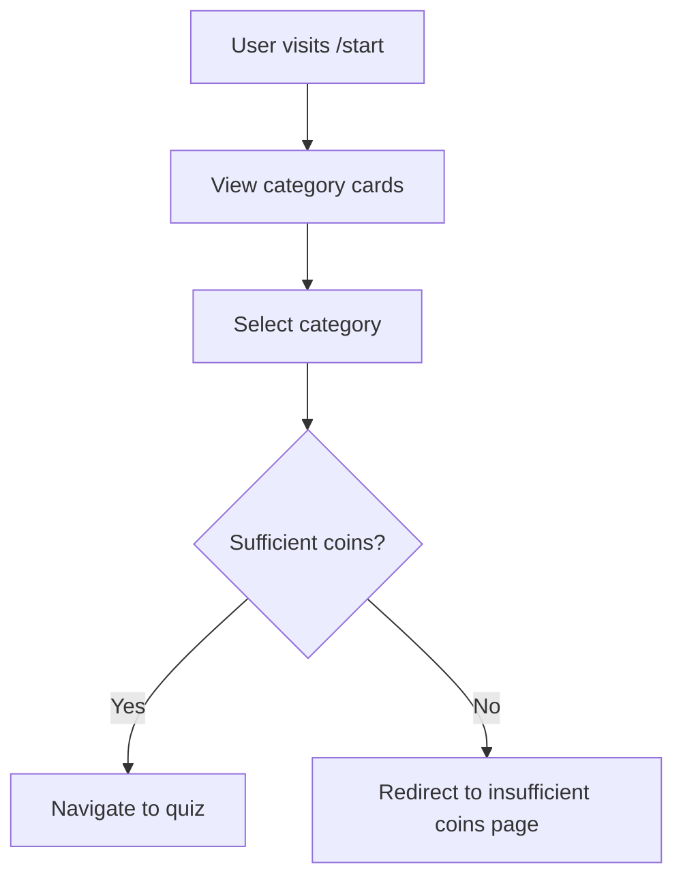

# TechKwiz Website Design Standards

**Version 1.0** | **Last Updated:** September 14, 2025 | **Maintained by:** TechKwiz Development Team

## 🎯 Overview

This document serves as the **single source of truth** for all UI/UX design standards in the TechKwiz Quiz App. It provides comprehensive guidelines for the visual design, component specifications, and user experience patterns that must be followed for all website development.

**⚠️ MANDATORY COMPLIANCE:** All UI/UX changes, feature additions, and visual modifications MUST reference and comply with this document. Any deviations require formal approval through the change control process.

## 🎨 Color Palette

### Primary Colors
- **Primary Blue 500**: `#3B82F6` - Main brand color, primary actions, links
- **Primary Blue 600**: `#2563EB` - Primary button backgrounds, active states
- **Primary Blue 700**: `#1D4ED8` - Pressed states, dark mode primary
- **Primary Blue 800**: `#1E40AF` - High contrast elements
- **Primary Blue 900**: `#1E3A8A` - Maximum contrast, headings

### Secondary Colors
- **Secondary Orange 500**: `#F59E0B` - Secondary actions, highlights
- **Secondary Orange 600**: `#D97706` - Secondary button hover states

### Background Gradient
- **Body Background**: `linear-gradient(135deg, #1e3c72 0%, #2a5298 100%)` - Main app background
- **Glass Effect Background**: `rgba(30, 60, 114, 0.8)` - Card and component backgrounds

### Quiz-Specific Colors
- **Quiz Option Background**: `rgba(42, 82, 152, 0.8)` - Default quiz option state
- **Selected Option**: `rgba(255, 193, 7, 0.8)` with border `#ffc107` - User selection
- **Correct Answer**: `rgba(40, 167, 69, 0.8)` with border `#28a745` - Correct feedback
- **Incorrect Answer**: `rgba(220, 53, 69, 0.8)` with border `#dc3545` - Incorrect feedback

### Semantic Colors
- **Success Green**: `#28A745` - Correct answers, positive actions
- **Warning Yellow**: `#FFC107` - Selected states, caution
- **Error Red**: `#DC3545` - Incorrect answers, error states
- **Info Blue**: `#3B82F6` - Informational messages, neutral actions

## 📝 Typography

### Font Family
- **Primary Font**: `Inter` with fallbacks `system-ui, sans-serif`
- **Font Loading**: Google Fonts CDN via `@import url('https://fonts.googleapis.com/css2?family=Inter:wght@300;400;500;600;700;800&display=swap')`

### Font Sizes
- **Heading 1**: `2.25rem` (36px) - Main page titles
- **Heading 2**: `1.875rem` (30px) - Section headings
- **Heading 3**: `1.5rem` (24px) - Subsection headings
- **Heading 4**: `1.25rem` (20px) - Card titles
- **Body Large**: `1.125rem` (18px) - Lead paragraphs
- **Body Regular**: `1rem` (16px) - Standard text
- **Body Small**: `0.875rem` (14px) - Secondary text
- **Caption**: `0.75rem` (12px) - Metadata and fine print

### Font Weights
- **Light**: `300` - Subtle text
- **Regular**: `400` - Standard text
- **Medium**: `500` - Emphasized text
- **Semi-Bold**: `600` - Subheadings, buttons
- **Bold**: `700` - Headings
- **Extra-Bold**: `800` - Page titles, hero text

## 📏 Spacing System (4px Grid)

### Scale
- **0**: `0` - No spacing
- **1**: `0.25rem` (4px) - Minimal spacing
- **2**: `0.5rem` (8px) - Micro spacing
- **3**: `0.75rem` (12px) - Small elements
- **4**: `1rem` (16px) - Standard spacing
- **6**: `1.5rem` (24px) - Section spacing
- **8**: `2rem` (32px) - Major sections
- **12**: `3rem` (48px) - Page-level spacing

### Component-Specific Spacing
- **Quiz Options**: `padding: 12px` - Mobile optimized
- **Cards**: `padding: 1.5rem` (24px) - Standard card padding
- **Navigation**: `padding: 0.75rem 1rem` (12px 16px) - Nav bar padding
- **Buttons**: `padding: 0.75rem 1.5rem` (12px 24px) - Button padding

## 🧩 Components

### Buttons

#### Primary Button
```css
.button-primary {
  background: linear-gradient(135deg, #3b82f6, #2563eb);
  border: none;
  border-radius: 12px;
  color: white;
  font-weight: 600;
  cursor: pointer;
  transition: all 0.3s ease;
  box-shadow: 0 4px 16px rgba(59, 130, 246, 0.3);
}

.button-primary:hover {
  transform: translateY(-2px);
  box-shadow: 0 6px 20px rgba(59, 130, 246, 0.4);
}
```

#### Secondary Button
```css
.button-secondary {
  background: rgba(42, 82, 152, 0.8);
  border: 2px solid transparent;
  border-radius: 12px;
  color: white;
  font-weight: 600;
  cursor: pointer;
  transition: all 0.3s ease;
  backdrop-filter: blur(10px);
}

.button-secondary:hover {
  background: rgba(42, 82, 152, 1);
  border-color: rgba(255, 255, 255, 0.3);
  transform: translateY(-2px);
  box-shadow: 0 4px 16px rgba(0, 0, 0, 0.2);
}
```

### Cards (Glass Effect)
```css
.glass-effect {
  background: rgba(30, 60, 114, 0.8);
  backdrop-filter: blur(10px);
  border: 1px solid rgba(255, 255, 255, 0.1);
  border-radius: 16px;
  box-shadow: 0 8px 32px rgba(0, 0, 0, 0.3);
}
```

### Quiz Options
```css
.quiz-option {
  background: rgba(42, 82, 152, 0.8);
  border: 2px solid transparent;
  border-radius: 16px;
  color: white;
  font-weight: 700;
  cursor: pointer;
  transition: all 0.3s ease;
  backdrop-filter: blur(10px);
  padding: 12px 12px;
  text-align: center;
  min-height: 52px;
  display: flex;
  align-items: center;
  justify-content: center;
  font-size: 15px;
  line-height: 1.4;
  width: 100%;
}

/* Mobile-specific improvements */
@media (max-width: 640px) {
  .quiz-option {
    padding: 12px 8px;
    min-height: 48px;
    font-size: 14px;
    border-radius: 20px;
    font-weight: 800;
  }
}
```

### Quiz Option States
```css
.quiz-option.selected {
  background: rgba(255, 193, 7, 0.8);
  border-color: #ffc107;
  transform: scale(1.05);
}

.quiz-option.correct {
  background: rgba(40, 167, 69, 0.8);
  border-color: #28a745;
  animation: correctAnswer 0.6s ease;
}

.quiz-option.incorrect {
  background: rgba(220, 53, 69, 0.8);
  border-color: #dc3545;
  animation: shake 0.5s ease;
}
```

## 📱 Responsive Design

### Breakpoints
- **Mobile (xs)**: 375px
- **Small (sm)**: 640px
- **Medium (md)**: 768px
- **Large (lg)**: 1024px
- **Extra Large (xl)**: 1280px
- **2x Extra Large (2xl)**: 1536px

### Mobile-First Approach
All designs should start with mobile styling and progressively enhance for larger screens.

### Responsive Design Guidelines
For detailed responsive design implementation guidelines, see [Responsive Design Guidelines](./RESPONSIVE_DESIGN_GUIDELINES.md).

## 🎭 Animations

### Framer Motion Patterns
- **Page Transitions**: `initial={{ opacity: 0, scale: 0.95 }}` to `animate={{ opacity: 1, scale: 1 }}`
- **Button Interactions**: `whileHover={{ scale: 1.02 }}` and `whileTap={{ scale: 0.98 }}`
- **Card Hover Effects**: `whileHover={{ scale: 1.02, y: -5 }}`

### CSS Keyframe Animations
```css
@keyframes fadeIn {
  from { opacity: 0; transform: translateY(20px); }
  to { opacity: 1; transform: translateY(0); }
}

@keyframes bounceIn {
  0% { opacity: 0; transform: scale3d(.3, .3, .3); }
  20% { transform: scale3d(1.1, 1.1, 1.1); }
  40% { transform: scale3d(.9, .9, .9); }
  60% { opacity: 1; transform: scale3d(1.03, 1.03, 1.03); }
  80% { transform: scale3d(.97, .97, .97); }
  100% { opacity: 1; transform: scale3d(1, 1, 1); }
}
```

## 🧭 Navigation

### Unified Navigation Component
The navigation component has three modes:
1. **Full Mode** (default): Complete navigation with all features
2. **Simple Mode**: Logo and basic navigation links
3. **Minimal Mode**: Logo only

### Navigation Items
- Home (`/`)
- Categories (`/start`)
- Leaderboard (`/leaderboard`)
- Profile (`/profile`)

## 🔄 User Flow

### Homepage Flow


### Category Selection Flow


## ✅ Compliance Checklist

### Before Implementation
- [ ] **Color Verification**: All colors match documented hex values
- [ ] **Typography Check**: Font sizes, weights, and families are correct
- [ ] **Spacing Audit**: Padding and margins follow 4px grid system
- [ ] **Component Consistency**: Using existing component patterns
- [ ] **Responsive Design**: Mobile-first approach implemented
- [ ] **Animation Standards**: Framer Motion patterns followed
- [ ] **Glass Effects**: Proper backdrop-filter and transparency values

### After Implementation
- [ ] **Visual Regression Tests**: All tests pass or baselines updated
- [ ] **Accessibility Check**: WCAG compliance verified
- [ ] **Performance Audit**: No significant performance degradation
- [ ] **Cross-Browser Testing**: Works on all supported browsers
- [ ] **Mobile Testing**: Proper display on all device sizes

## 📋 Change Control Process

### For Minor Changes (Color tweaks, spacing adjustments)
1. Update this document
2. Update component implementation
3. Update visual regression test baselines
4. Document changes in changelog

### For Major Changes (New components, layout changes)
1. Submit change request with impact assessment
2. Get approval from Design System Owner and Technical Lead
3. Update this document with new specifications
4. Implement changes in code
5. Update visual regression tests
6. Document in changelog

## 📚 References

- **Design System**: [docs/DESIGN_SYSTEM.md](../DESIGN_SYSTEM.md)
- **Responsive Design Guidelines**: [docs/website-standards/RESPONSIVE_DESIGN_GUIDELINES.md](./RESPONSIVE_DESIGN_GUIDELINES.md)
- **Component Organization**: [docs/architecture/COMPONENT_ORGANIZATION.md](../architecture/COMPONENT_ORGANIZATION.md)
- **Project README**: [README.md](../../README.md)
- **Global Styles**: [src/app/globals.css](../../src/app/globals.css)
- **Navigation Component**: [src/components/navigation/UnifiedNavigation.tsx](../../src/components/navigation/UnifiedNavigation.tsx)